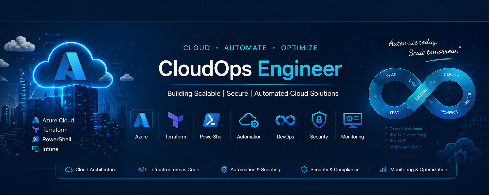

<p align="center">
  
</p>

---

### 👨‍💻 About Me

```powershell
function Get-ShabeerProfile {
    $profile = @{
        Role        = "CloudOps Engineer"
        Experience  = "13+ years in Enterprise IT"
        Focus       = "Azure | Cloud Infrastructure | Automation"
        Currently   = "Cloud Ops Engineer"
        Learning    = @("Docker", "Kubernetes", "Azure DevOps", "AZ-305")
        Mindset     = "Hands-on, project-driven, always shipping"
        Motto       = "Automate the boring. Document the rest."
    }
    return $profile
}

Get-ShabeerProfile
```

---

### 🚀 What I'm Working On

- 🔭 **Currently building:** Modular Terraform architectures on Azure (AVD, Firewall, App Gateway, Load Balancer)
- 🌱 **Currently learning:** Docker, Kubernetes (AKS), and CI/CD pipeline ownership
- 🎯 **Career goal:** Azure Cloud Enthusiast ☁️ | CloudOps  | Exploring Azure Administration
- 💼 **Open to:** Cloud Engineering opportunities (India / UAE / Qatar / KSA)
- 💬 **Ask me about:** Azure Virtual Desktop, Azure Networking, Terraform modules, Ansible automation

---

### 🛠️ Tech Stack

#### ☁️ Cloud & Infrastructure
<p>
  
  
  
  
</p>

#### 🔧 Infrastructure as Code & Automation
<p>
  
  
  
  
  
</p>

#### 🐳 Containers & Orchestration *(Learning)*
<p>
  
  
  
</p>

#### 🔄 DevOps & Tools
<p>
  
  
  
  
  
</p>

---

### 🏆 Certifications

<p align="center">
  
  
  
</p>

---

### 📊 GitHub Stats

<p align="center">
  
  
</p>

<p align="center">
  
</p>

---

### 🏆 GitHub Trophies

<p align="center">
  
</p>

---

### 📈 Contribution Activity

<p align="center">
  
</p>

---

### 🌟 Featured Projects

| Project | Description | Tech Stack |
|---------|-------------|------------|
| 🔒 [**terraform-3tier-private-lab**](https://github.com/Shabeer1024/terraform-3tier-private-lab) | Production-grade 3-tier Azure architecture with Private Endpoints — data tier has zero public attack surface. Banking-compliant pattern. | `Terraform` `Azure` `PrivateEndpoint` `Security` |
| 🖥️ [**azure-avd-infra-automation**](https://github.com/Shabeer1024/azure-avd-infra-automation) | Enterprise AVD automation with golden image pipeline, FSLogix, monitoring & auto-scaling | `Terraform` `Azure` `AVD` |
| 📦 [**avd-image-automation**](https://github.com/Shabeer1024/avd-image-automation) | Automated AVD image build & deployment pipeline | `Terraform` `Azure` |
| ⚙️ [**Terraform-Works**](https://github.com/Shabeer1024/Terraform-Works) | Collection of production-ready Terraform modules | `Terraform` |

---

### 📫 Connect With Me

<p align="center">
  <a href="https://www.linkedin.com/in/shabeer-s-82690a156">
    
  </a>
  <a href="mailto:shabeer.shukoor@outlook.com">
    
  </a>
  <a href="https://github.com/Shabeer1024">
    
  </a>
</p>

<p align="center">
  
</p>

---

<p align="center">
  <i>"Infrastructure as Code is not just about automation —<br/>it's about building systems that are reliable, repeatable, and reviewable."</i>
</p>

<p align="center">
  ⭐ <i>If you like my work, consider following me!</i> ⭐
</p>


